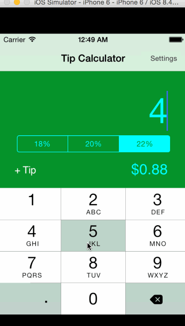

# TipCalculator

This is the IOS prework for my CodePath application.

Time Spent: 12 hours

Completed User Stories:
 * [x] Required: Created the basic tip calculator 
 * [x] Required: Settings page to choose a default tip percentage
 * [x] Optional: Remember the bill amount across app restarts. If returning after 10 minutes, reset the bill amount
 * [x] Optional: Use modal transitions between main view and settings page. Dismiss the modal transition programatically.
 * [x] Optional: Hide the other fields on the main view if the bill amount is empty. 
 
 
Walkthrough:

